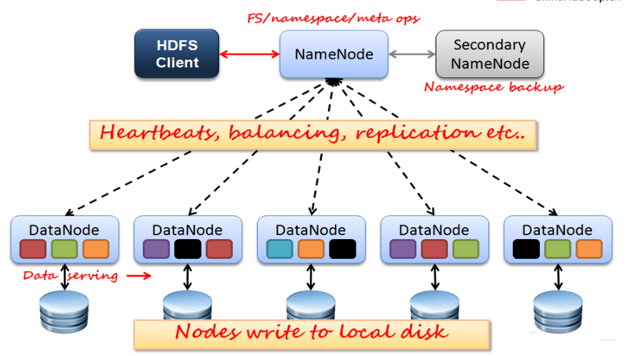
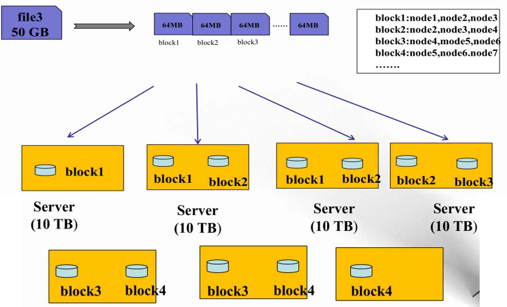
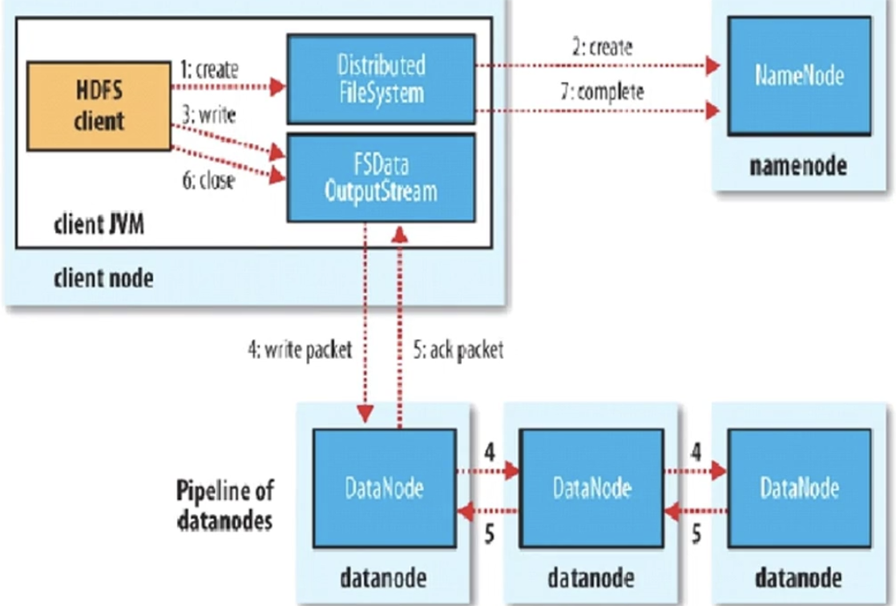
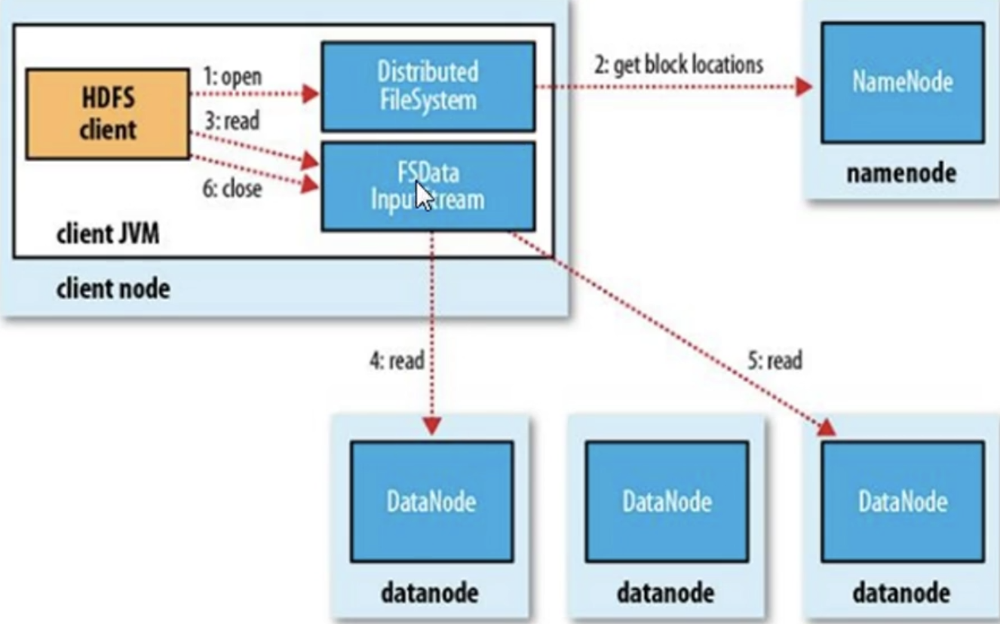

# Hadoop-HDFS

## 存储模型

* 文件线性切割成块(Block)
* 偏移量 offset (考虑byte,中文的情况)，偏移量起到定位的作用      
* 单一文件block大小一致(最后一个可以不一样)，文件与文件可以不一致
* block可以设置副本数(不同的副本散落在不同的server上，为了数据安全)，副本无序分散在不同节点中，但是副本数不要超过节点数量，一般为3
* 文件上传可以设置Block大小和副本数（资源不够开辟的进程），hadoop中block默认值为128M，最小1M，副本数量可以自定义，如果这个block有很多进程运行，该block副本数应该多设置
* 已上传的文件Block副本数可以调整，大小不变
* 只支持一次写入多次读取，一旦写入，不能改变block大小，大小变了，其他和其相关联的block索引也会发生变化，同一时刻只有一个写入者
* 可以append追加数据，新的数据会添加在block的末尾分块内

## 架构模型Framework

* 文件元数据MetaData，文件数据：元数据，数据本身
* （主）NameNode（只有一个）节点保存文件元数据：单节点 posix metadata size offset 每批文件的映射（存储的位置）维护存放在集群中的block文件的元数据信息block数量，大小，偏移量
* （从）DataNode节点保存文件block数据：多节点，维护管理自己的节点之上的块文件
* DataNode与NameNode之间保持心跳，DataNode要主动向NameNode上传block列表（原因：理论上来说DataNode会最先获知节点失效的信息）
* HdfsClient与DataNode交互元数据信息（cs）有利于数据的存与取，NameNode根据client的需求或者文件的大小，将数据切割存储到不同的DataNode上。只告诉具体地址，不带着去存或取，不然NameNode负载过大
* DataNode利用服务器本地文件系统存储数据块

## HDFS架构图

颜色一样的表示为副本

HDFS client 与NameNode交互之后，会与DataNode进行交互

存储50GB的数据

先将文件进行切割，并生成每个副本存放的节点列表，有NameNode进行维护

## NameNode

* 基于内存存储：不会和磁盘发生交换（双向）（关系型数据库会发生双向交换）

* 只存在内存中（存储速度快）

* 持久化（单向）原因：内存存储，掉电即失，把内存中的数据存储到磁盘中，永远从内存向磁盘写东西，恢复数据时起到作用

### NameNode主要功能

* 接受客户端的读写请求
* 收集DataNode汇报的block列表信息

### NameNode保存的metadata信息组成

* 文件ownership和premissions
* 文件大小，时间
* block列表：block偏移量，位置信息（持久化不存，指不会放到持久化的磁盘当中，可能node在启动时宕机，需要datanode主动上报）
* block每副本的位置

### NameNode持久化

* NameNode的metadata信息在启动后会加载到内存
* metadata存储到磁盘文件名为"fsimage"（磁盘镜像快照）（时点备份）做一个序列化与反序列化操作，避免版本不兼容，block的位置信息不会保存到fsimage，这种方法写的时候慢，但是恢复的时候特别快。fsimage一般是定时完成。
* edits记录对metadata的操作日志，每来一条l指令，就将信息存储到日志log中，但是恢复起来会特别慢（比如存了十年的数据），这种方法写的时候快，但是恢复起来特别慢。
* 在系统格式化后会产生第一个fsimage文件，hadoop启动时选去读取fsimage文件，并产生一个edits文件，二者合一产生一个新的fsimage，之后指令会写到edits中，edits会急速扩展，在达到一定程度之后会与fsimage合并。

### SecondaryNameNode（SNN）Hadoop1.0解决数据持久化的方法，2.0版本之后弃用

* 他不是NN的备份（但是可以做备份），他的主要工作是帮助NN合并editslog，减少NN启动时间。

* SNN执行合并时机

  * 根据配置文件设置的时间间隔fs.checkpoint.period  默认3600秒 

  * 根据配置文件设置edits log大小 fs.checkpoint.size 规定edits文件的最大值默认是64MB  

  

 ## DataNode

* 本地磁盘目录存储数据（Block），文件形式
* 同时存储Block的元数据信息文件，元数据与本地block产生关联（MD5文件），在下载之前，先将MD5上传到NameNode进行验证（MD5解码操作），避免磁盘坏道下载坏文件
* 启动DN时会向NN汇报block信息（是一种主动行为）
* 通过向NN发送心跳保持与其联系（3秒一次），如果NN 10分钟没有收到DN的心跳，则认为其已经lost，并copy其上的block到其它DN

## HDFS优点

* 高容错性
  * 数据自动保存多个副本
  * 副本丢失后，自动恢复（丢失之后，自动完成拷贝的功能）
* 适合批处理
  * 移动计算而非数据，尽量规避节点之间数据的传输，尽量将计算程序放在本地跑
  * 数据位置暴露给计算框架（Block偏移量）
* 适合大数据处理
* 可构建在廉价机器上
  * 通过多副本提高可靠性
  * 提供了容错和恢复机制

## HDFS缺点

* 做不到低延迟数据访问
  * 作业时间一般都需要分钟级别，做不到毫秒级
  * 单节点存储数据量大小有要求，最小为1M
* 小文件存取
  * 占用NameNode大量内存，维护大文件元数据信息
  * 寻道时间超过读取时间（文件放在不同位置）
* 并发写入、文件随机修改
  * 一个文件只能有一个写者，写的时候不能修改块的大小
  * 仅支持append

## Block的副本放置策略

* 第一个副本：放置在上传文件的DN（放在本地，rackA）；如果在集群外提交，则随机挑选一台磁盘不太满，CPU不太忙的节点

* 第二个副本：放置于第一个副本不同的机架的节点上（RackB）
* 第三个副本：与第二个副本相同机架的节点（RackB，其他的服务器）
* 更多副本：随机节点

## HDFS写流程

* Client：
  * 切分文件Block
  * 按Block线性和NN获取DN列表（副本数）
  * 验证DN列表之后以更小的单位流式传输数据
    * 各节点，两两通信确定可用（pipeline）
  * Block传输结束之后
    * DN向NN汇报block信息
    * DN向Client汇报完成
    * Client向NN汇报完成
  * 获取下一个Block存放的DN列表
  * 最终Client汇报完成
  * NN会在写流程更新文件状态

## HDFS读流程

* Client
  * 和NN获取一部分Block副本位置列表
  * 线性和DN获取Block，最终合并为一个文件
  * 在Block副本列表中安距离择优选用
  * MD5验证数据完整性

