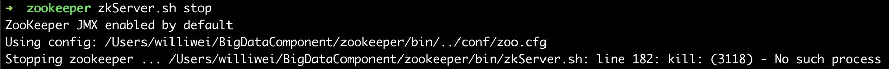

# 解决：关闭zookeeper时出现Stopping zookeeper ... /zookeeper/bin/zkServer.sh: line 182: kill: (3118) - No such process

## 问题

之前配置完zookeeper运行的一直没问题，但是昨天启动zookeeper之后一直关闭不了，运行zkServer.sh stop一直提示如下

查看一下jps进程

常规思路 直接kill -9 2712 不就行了么，我自己手动杀还不行么

但是，真的不行。。。杀了之后真的不行，QuorumPeerMain这个进程你怎么杀他都一直在

## 尝试解决

* 1、遇到问题肯定先百度，百度之后发现有一篇博客说，zoo.cfg配置文件中的dataDir配置中的文件路径不正确可能会导致这个问题，但检查过后发现并不是这个原因
* 2、系统兼容问题，因为前段时间mac系统刚刚升过级，之前就因为新版本系统导致原来很多的应用出现了兼容问题，这次会不会也是这个原因呢，但是更新前几天zookeeper也是能跑，这次更新是小版本更新，再加上懒得折腾下载别的版本的zookeeper，遂放弃

## 最终解决

* 查看zookeeper.out文件，发现原来zookeeper默认的2181一只在被监听

  

* so，查看在监听2181端口的进程

  

* 二话不说，直接kill

* 但是还是不行，关闭zookeeper还是报原来一样的错，而且这个进程也是一直存在杀不掉。。。

* 那么直接在macos中的活动监听器中查看该进程的具体信息，发现该进程的父进程是bash

* 那么连着bash一起kill，kill之后，QuorumPeerMain进程是消失了，但是启动zookeeper之后，想要关闭，还是报一样的错

* 最后想起来，可以换一个端口监听，于是把zoo.cfg中的默认端口换为2182

* 启动zookeeper，关闭zookeeper，不再报错

  

## 总结

* 以后解决问题还是要看日志
* 该问题在linux系统下应该直接kill掉监听端口的进程就解决了，macos下可能是一个系统进程要一直监听2181端口，时间问题，没有继续向下深究