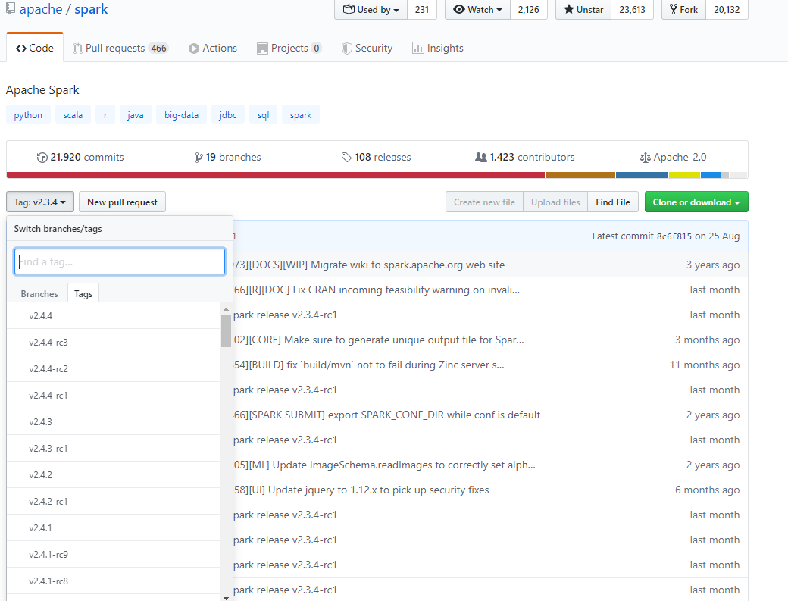
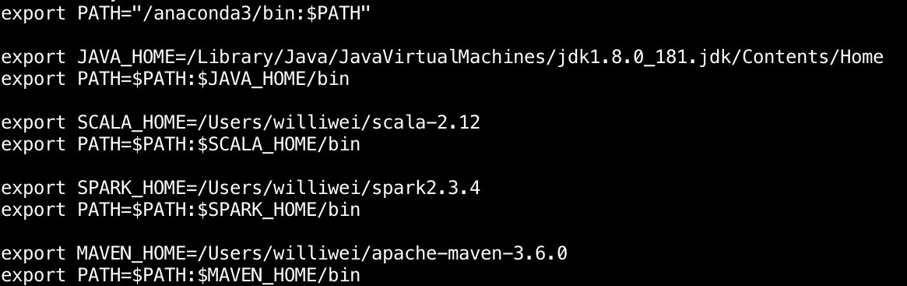
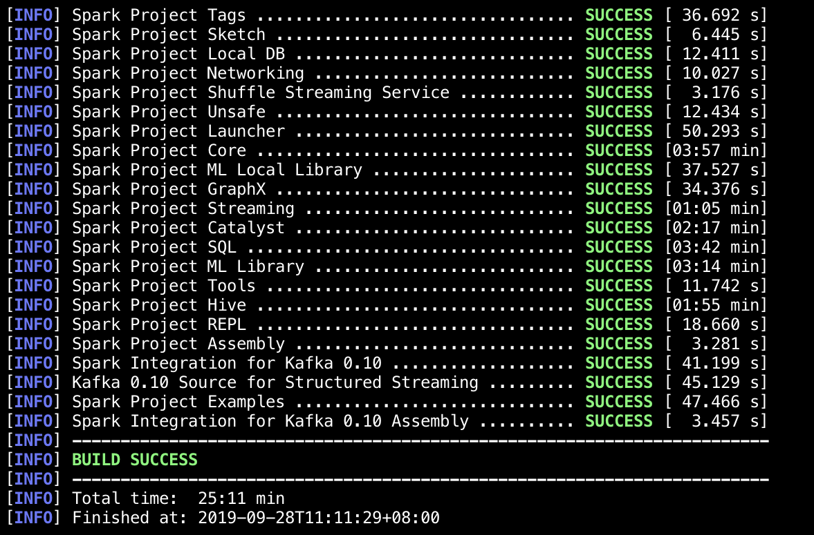

# macos下编译Spark2.3.4源码

## 配置环境

* 下载Scala2.12

* 在github中下载Spark源码，clone或者直接下载都可以

  

* 下载完之后配置java，spark，maven，scala环境变量如下`vim ~/.bash_profile`

  

  配置完成之后记得`source .bash_profile`

## 开始编译

* 进入Spark的目录`mvn -DskipTests clean package`，如编译成功，则如下所示

  

  

